<p align="center">
  <a href="" rel="noopener">
 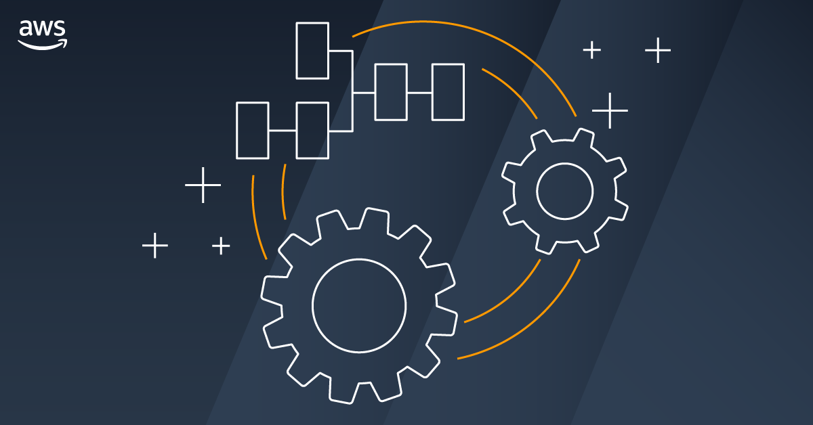</a>
</p>

# **Monitoring your gauges on the factory floor with AWS IoT Things Graph**
# **Introduction**

One of the common challenges that many industrial customers face is that they have sources of information that are visual and cannot be easily captured in a digital format. These data sources can be critical in understanding the overall status of the industrial operations. In this post, we will demonstrate how to build and customize an [AWS IoT Things Graph](https://aws.amazon.com/iot-things-graph) flow that processes and analyses images from analog gauges captured from a factory floor. 

AWS IoT Things Graph is an orchestration service that simplifies development of IoT applications. These applications can use different devices and web services from different manufacturers that otherwise can't communicate with each other because they use different protocols, data formats, and message syntax. '

In this post we will discuss the different components of AWS IoT Things Graph and build different flows and deploy them both at the edge and in the cloud. 

Read more on the accompanying [blog post](https://aws.amazon.com/blogs/iot/monitoring-your-gauges-on-the-factory-floor-with-aws-iot-things-graph/).

# **Solution Overview**

The following diagram depicts the architecture of the solution for the first part of this workshop that describes deploying a flow to the cloud. Later, in the second part of this workshop we will describe deploying a flow to an edge device.

In the following diagram you can see the architecture of the solution. When an image of an analog gauge gets uploaded into our [Amazon Simple Storage Service (S3)](https://aws.amazon.com/s3/) bucket, an event is generated. This event triggers an [AWS Lambda](https://aws.amazon.com/lambda) function that publishes a message to both an [AWS IoT Core ](https://aws.amazon.com/iot-core)topic and an [Amazon Simple Queue Service (SQS)](https://aws.amazon.com/sqs) queue. Any messages received on the AWS IoT Core topic will act as a trigger for the  AWS IoT Things Graph flow and will start a new flow. Once the flow starts it will go through a sequence of steps to process the image and return the gauge reading. 

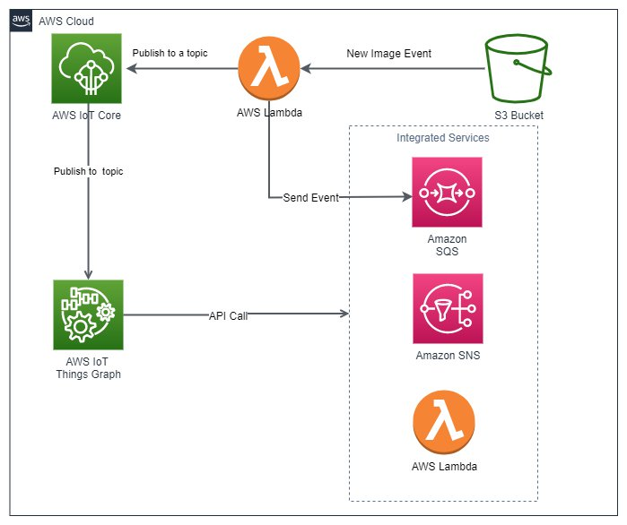


# **Prerequisites**
- This example uses the US East 1 (North Virginia) Region. However, you can choose another AWS Region of your choice where AWS IoT Things Graph is available. Visit the [AWS Region table](https://aws.amazon.com/about-aws/global-infrastructure/regional-product-services/) for a full list of AWS Regions where AWS services are available.
- AWS account in the same AWS Region.
- **AdministratorAccess** policy granted to your AWS account (for production, we recommend restricting access as needed).
- [Amazon VPC](https://aws.amazon.com/vpc/) and a public subnet where an [Amazon EC2](https://aws.amazon.com/ec2) instance hosting [AWS IoT Greengrass](https://aws.amazon.com/greengrass) can be deployed on.
- Amazon EC2 KeyPair for your selected AWS Region. For instructions, see [Amazon EC2 Key Pairs](https://docs.aws.amazon.com/AWSEC2/latest/UserGuide/ec2-key-pairs.html) in the Amazon EC2 user guide for Linux instances.
- AWS IoT Greengrass service role in the US East 1 (North Virginia) Region. For further instructions visit [Managing the Greengrass service role](https://docs.aws.amazon.com/greengrass/latest/developerguide/service-role.html#manage-service-role-console) description.

# **Building your first Things Graph flow**
## **To set up your Cloud9 environment**

In this workshop we use [Cloud9](https://aws.amazon.com/cloud9/) as our development environment to build the necessary packages needed for your Lambda functions as well as to create our AWS IoT Things Graph resources.

1. Download the application from the following repository [ThingsGraphWorkshop ](https://github.com/aws-samples/aws-iot-things-graph-workshop). 
2. Open the AWS CloudFormation console. In the navigation pane, select **Stacks** and then choose **Create stack.**
3. Create a new AWS CloudFormation stack by uploading the YAML file **cloudformation-templates/template-1.yml** and click Next. Further instructions on how to create AWS CloudFormation stacks can be found in [Selecting a stack template](https://docs.aws.amazon.com/AWSCloudFormation/latest/UserGuide/cfn-using-console-create-stack-template.html) description.
4. Enter the **Stack name** as **things-graph-workshop-stack-1**, leave the rest as default and choose **Next**.

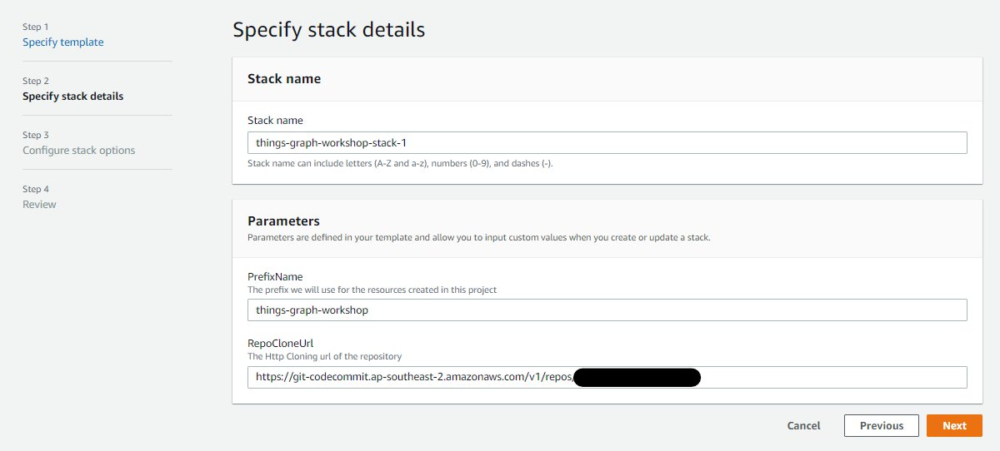

5. In the **Configure stack options** page, scroll down to the bottom of the page and choose **Next.**
6. In the **Review** page, scroll down and choose **Create stack.**
7. Once the stacks status has changed to **CREATE\_COMPLETE** , select the **Outputs** tab and make note of the value of **ArtifactBucketName**.

This AWS CloudFormation template creates a Cloud9 environment for you to use as your development environment. It also creates an Amazon S3 bucket that will serve as your project artifact repository.

## **To build the Lambda packages**

We use Cloud9 as a development environment to build the packages we need to deploy for our Lambda function. Using Cloud9 you can make modifications to the existing code base and build and deploy the packages.  

1. In the AWS console, select Cloud9 from the Services drop down and open it in a new tab. In your Cloud9 environments, you should now see a new environment titled **things-graph-workshop-C9**.
2. Choose **Open IDE** to open up your development environment. 

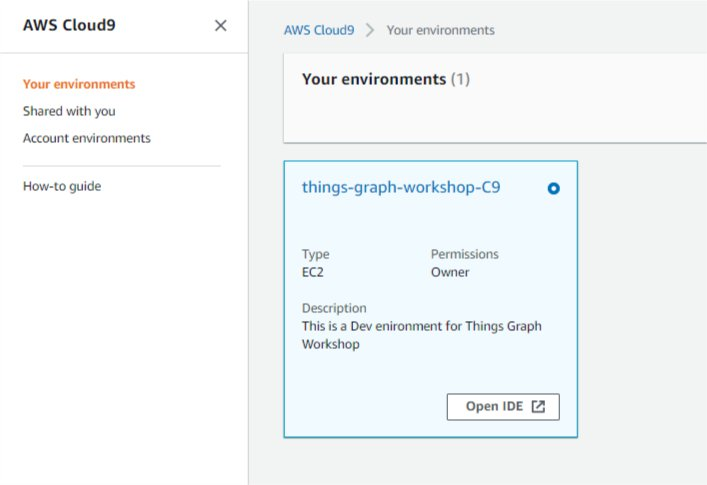

3.  Once your IDE is open, execute the following commands:

```
git clone https://github.com/aws-samples/aws-iot-things-graph-workshop
cd aws-iot-things-graph-workshop
./builds/cloud9Resize.sh
./builds/build.sh <Replace with value of ArtifactBucketName>
```

This command takes 5-10 minutes to run in order to download all the necessary resources and build the packages needed for the Lambda functions. Note, it will increase the disk size of your Cloud9 environment.

Using the Cloud9 environment, we built a project and uploaded all the necessary artifacts to the provided Amazon S3 bucket. The zip file, **things-graph-workshop.zip**, will be used by the second AWS CloudFormation template to construct the Lambda functions.

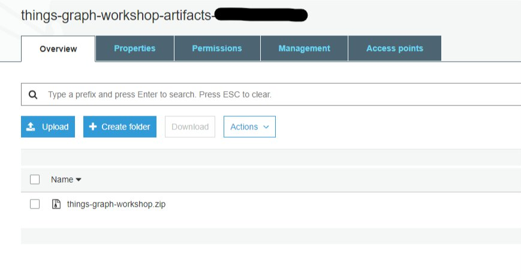

## **To set up your AWS IoT environment**
1. Open the AWS CloudFormation console.
2. In the navigation pane, select **Stacks** and then choose **Create stack.**
3. Create a new AWS CloudFormation stack by uploading the YAML file **cloudformation-templates/template-2.yml** and then choose **Next**.
   1. Enter the **Stack name** as **things-graph-workshop-stack-2.**
   1. Select **EC2KeyPair** from the drop down list.
   1. Leave the remaining of the fields as default and choose **Next.**

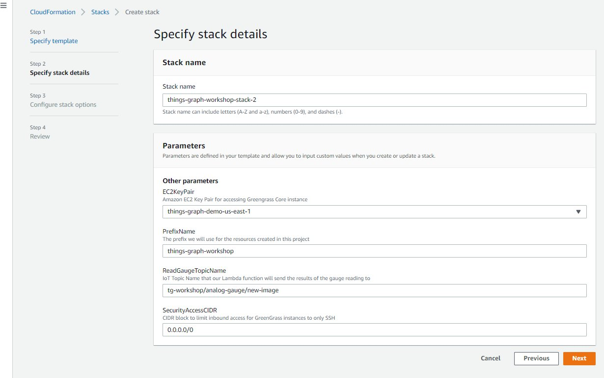


4. In the **Configure stack options** page, scroll down to the bottom of the page and choose **Next.**
5. In the **Review** page, scroll down and the check the box giving AWS CloudFormation permission to create the necessary resources.

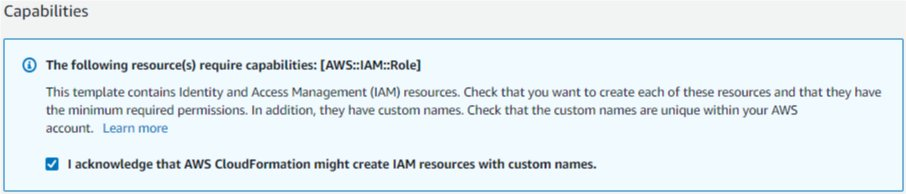

6. Choose **Create Stack**. This sets up most of the resources needed for the workshop.
7. Navigate to the **Resources** tab of the stack and review all the created resources for this workshop.

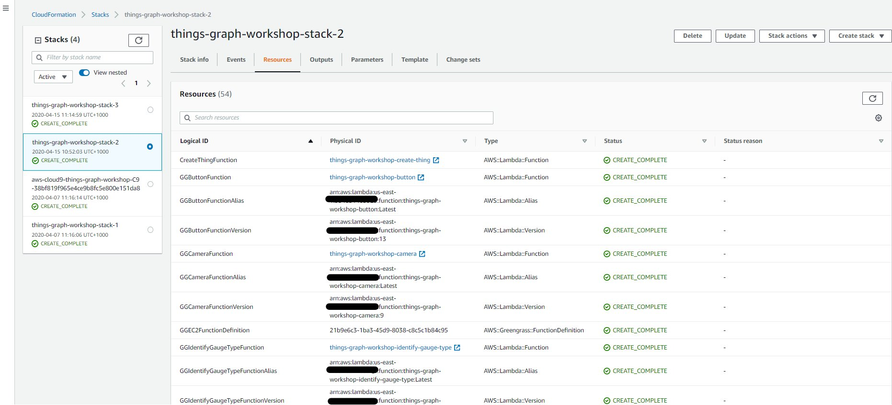

By creating this CloudFormation stack, you just created most of the resources needed for this workshop, including:

- IAM Roles and profiles needed for the different AWS services and Lambda functions
- Lambda functions
- Different AWS IoT resources such as Greengrass Groups, Things, profiles and certificates
- AWS IoT EC2 instance with AWS IoT Greengrass installed
- Other services such as Amazon SQS and Amazon SNS


Once the stack status changes to **CREATE\_COMPLETE,** create a third AWS CloudFormation stack. 
1. Open the AWS CloudFormation console. In the navigation pane, select **Stacks** and then choose **Create stack**. Upload the YAML file **cloudformation-templates/template-3.yml.**
2. Enter the **Stack name** as **things-graph-workshop-stack-3.** Leave the remaining fields as default.

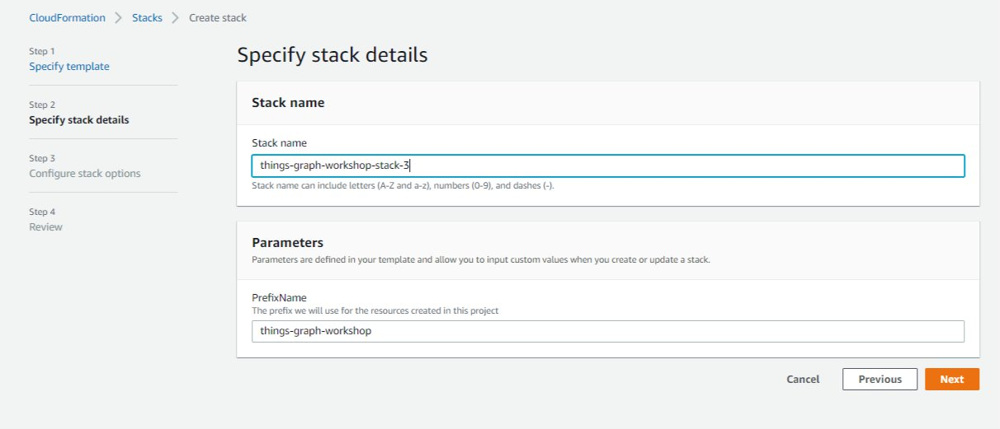

3. In the **Configure stack options** page scroll down to the bottom of the page and choose **Next.**
4. In the **Review** page scroll down and choose **Create stack.**
## **To set up your AWS IoT Things Graph flow**
### **Creating your models**

Once the AWS CloudFormation stack has been successfully created, execute the following commands from your Cloud9 environment:

```
cd aws-iot-things-graph-workshop
./builds/buildThingsGraph.sh
```

By running the **buildThingsGraph.sh** script on Cloud9 you have already created the AWS IoT Things Graph models required for this workshop. These models define the different devices and services that we will be using.

AWS IoT Things Graph can communicate with the different devices and web services and orchestrate interactions between them through the use of reusable abstractions known as models. Models define the supported actions and events generated by the devices. Models also describe how to invoke those actions and read the generated events. 

For a more detailed explanation about AWS IoT Things Graph models refer to the [AWS IoT Things Graph Data Model reference](https://docs.aws.amazon.com/thingsgraph/latest/ug/iot-tg-models.html) documentation.

You can view the created models by navigating to  the **Model** section in AWS IoT Things Graph console.
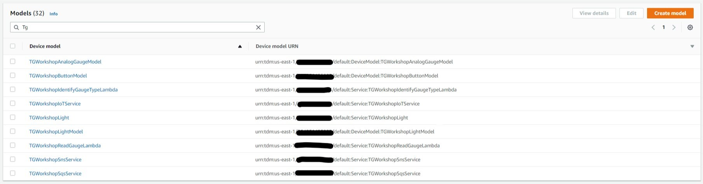


### **To assign your AWS IoT Greengrass device**

The AWS IoT Things Graph flow uses several devices to execute the flow. You now need to create an association between IoT Things and the AWS IoT Things Graph device models that were created via the AWS CloudFormation template. 

1. Open the AWS IoT Things Graph console.
1. In the navigation pane, select **Things**. Then select your newly created **things-graph-workshop-ec2-gg-core** from the list of things presented.
1. Choose **Associate with device** and associate the thing with the **TGWorkshopAnalogGauge** device.

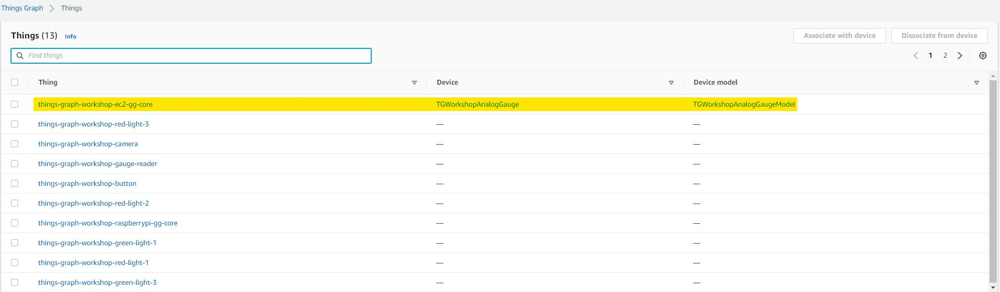

### **To Create the flow**

AWS IoT Things Graph flows define how the devices and services interact with each other. A flow lists these interactions as a sequence of steps. Each step contains an action on a device or web service and the related inputs and outputs to/from that action. For more information, refer to the [How a flow works](https://docs.aws.amazon.com/thingsgraph/latest/ug/iot-tg-whatis-howitworks.html) documentation.

In this workshop we are building a workflow that gets triggered whenever an image is uploaded into our Amazon S3 bucket. The flow is responsible for orchestrating the different steps that are needed to process this image. These steps are a combination of API calls and/or device integrations. 

1. Open the AWS IoT Things Graph console.
2. In the navigation pane, select **Flows** and then choose **Create flow.**

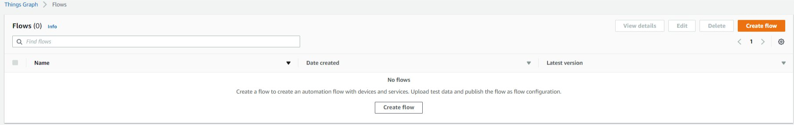

3. Set the **Title of flow** to **ThingsGraphWorkshopFlow** and choose **Create Flow**.
4. In the AWS console choose **Edit definition document**. 

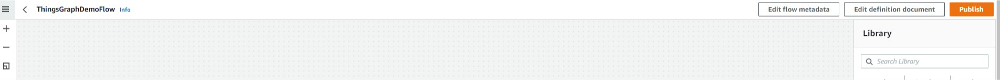

5. Copy and paste the contents of the modified **models-tmp/flows/cloud-flow.graphql** file from your Cloud9 editor and paste it into the editor and choose **Update**.

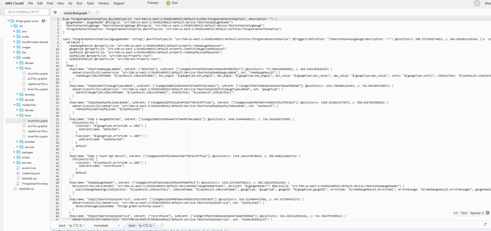

6. You can now see the graphical diagram of the flow.

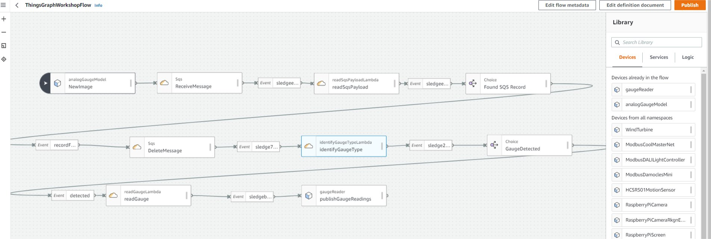

7. Choose **Publish** to publish your flow.

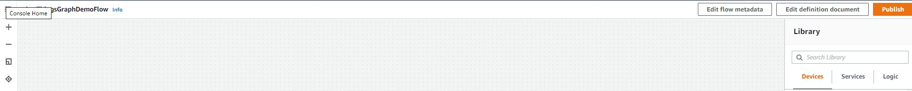


Review the published AWS IoT Things Graph flow. The flow is triggered when a message is sent to a particular MQTT topic. The flow collects information about the most recently published image from Amazon SQS, then processes that image and reads the gauge.
### **To deploy the flow in the cloud**

Once you have published the AWS IoT Things Graph flow you can choose to deploy it to either the cloud or your AWS IoT Greengrass device on the edge. 

1. Open the AWS IoT Things Graph console.
2. In the navigation pane, select **Deploy** and then choose **Create flow configuration.**
3. In the **Describe flow configuration** page:
   1. Set the **Flow** to **ThingsGraphWorkshopFlow** from the drop down.
   2. Set the **Name** to **things\_graph\_workshop\_cloud\_deployment**.
   3. Set the flow to run in the **Cloud** and choose **Next**.

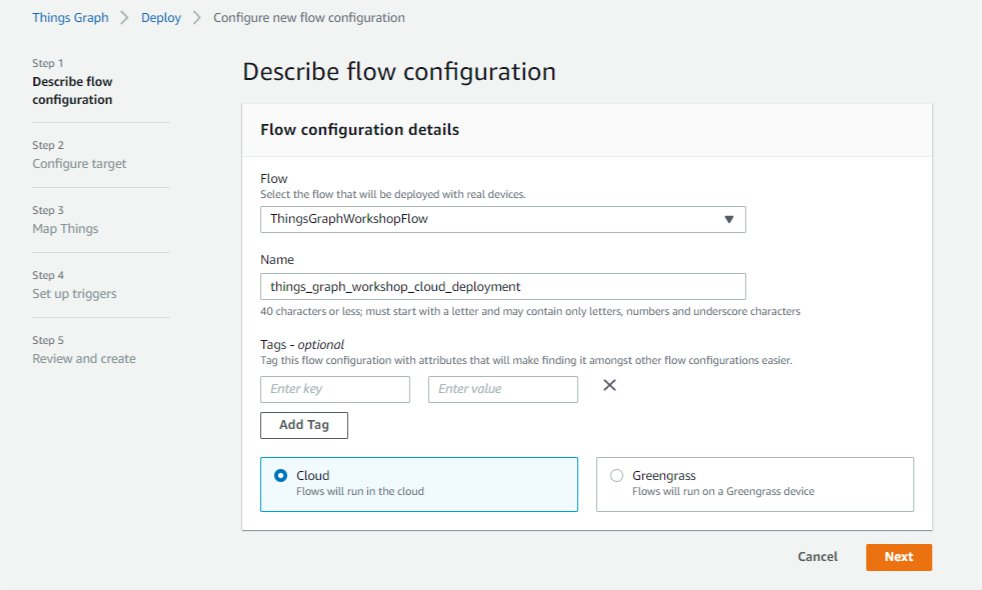

4. Assign a role to your flow deployment that will allow it to invoke other services. To do this, find the ARN of the IAM role that was created by the AWS CloudFormation stack. You can find the ARN in the output of your AWS CloudFormation stack or by finding the role in IAM. 

5. Open a new browser tab and open the AWS CloudFormation console.
6. In the navigation pane, select **Stacks** and then choose **things-graph-workshop-stack-2**.
7. Select the **Outputs** tab and copy the **Value** column for the key **ThingGraphRoleArn.** 
8. Navigate back to the Things Graph tab and past the role ARN to the **Flow actions role ARN** field as shown in the image bellow. 
9. Select **Enable metrics** and choose **Next**.

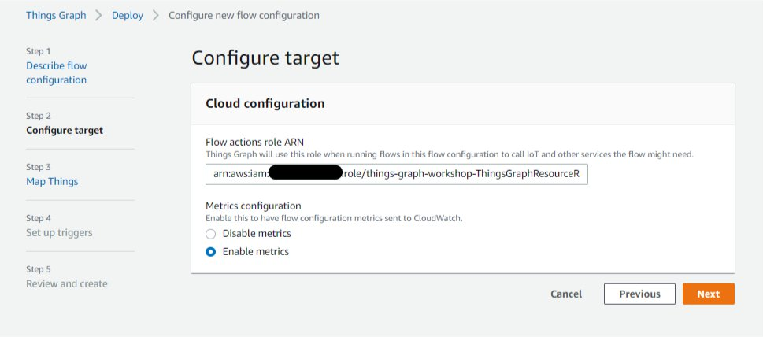

10. From the drop down list select your newly create AWS IoT Greengrass core and assign it to the model and choose **Next**.

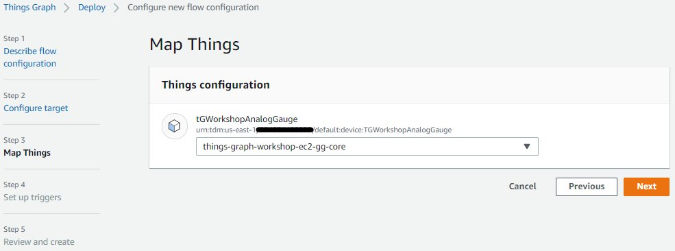

11. Leave the **Set up triggers** page as default and choose **Review**.

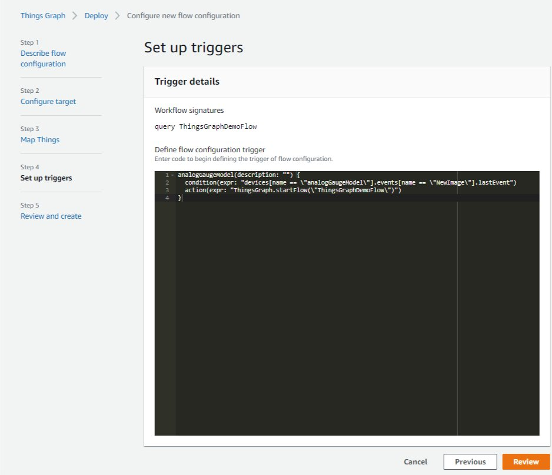


12. Scroll down to the bottom of the page and choose **Create** .

Congratulations, you have now created your first flow configuration in AWS IoT Things Graph.

Select your newly created flow from the **Flow configuration** page and choose **Deploy**.

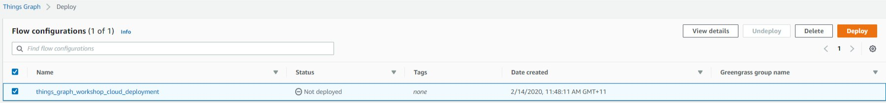

You should see a notification at the top of the page for a successful deployment.

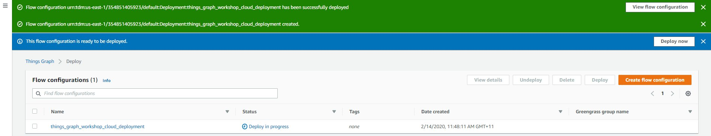


Note, if you change any of the underlying models of your flow, you will also need to undeploy and then deploy your flow configuration.
### **To test your new flow**

Test the new flow by uploading some images to our Amazon S3 bucket.

1. Open the AWS IoT Core console.
2. In the navigation pane, select **Test** and select **MQTT test client.**
3. In the **Subscription topic** field enter **things-graph-workshop/gauge/reading** and choose **Subscribe to a topic**.

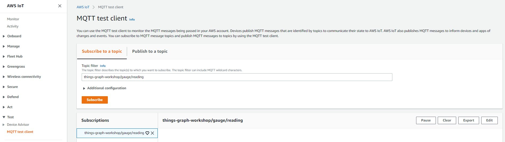

4. Open a new browser tab and open the Amazon S3 console.
5. Select the bucket, **things-graph-workshop-images-${accountNumber}-${region}** and upload your images - you can find images of different gauges inside of your project repository in the **images/gauge/temperature** folder.

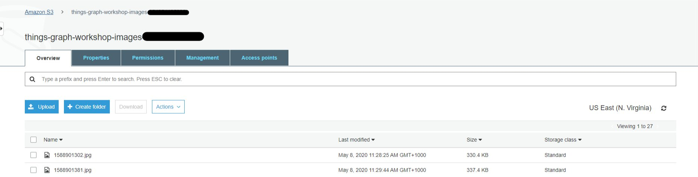

6. After you have uploaded the images to the Amazon S3 bucket, switch back to your browser tab showing AWS IoT Core listening to the MQTT topic. You should see a message appear in about 15 seconds after uploading the image.

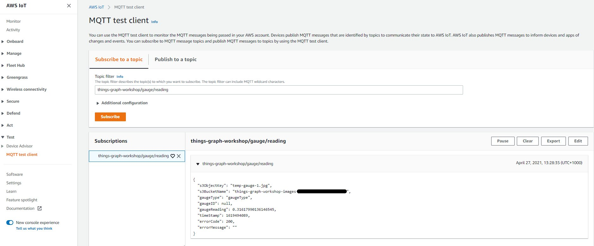

7. Return to the AWS IoT Things Graph console, select **Deploy,** and choose your deployed flow to view the details of your recently deployed flow.

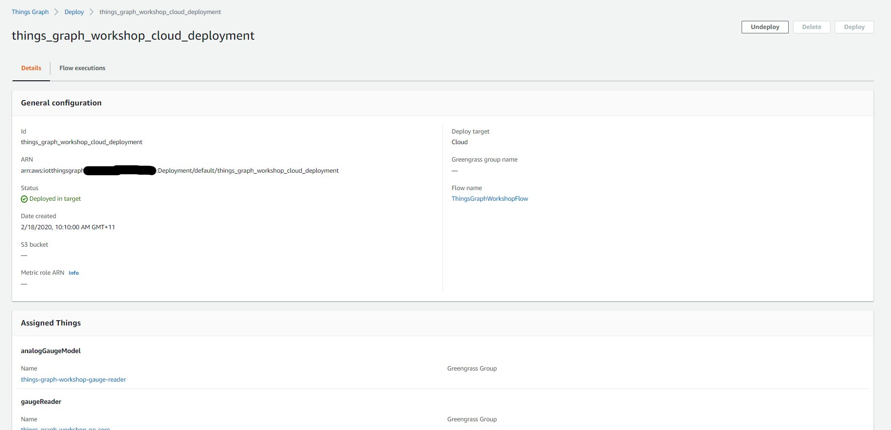

8. Select the **Flow executions** tab to display the most recent executed flows.

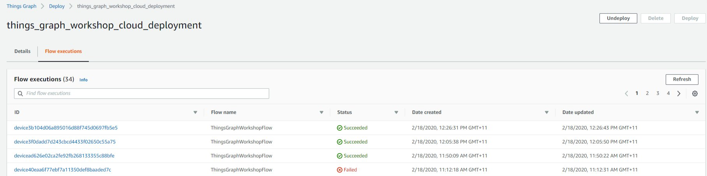

9. To display the detailed step-by-step execution of the flow, click on the most recent ID. This view is useful for understanding how the flow is executing and to debug any potential issues.

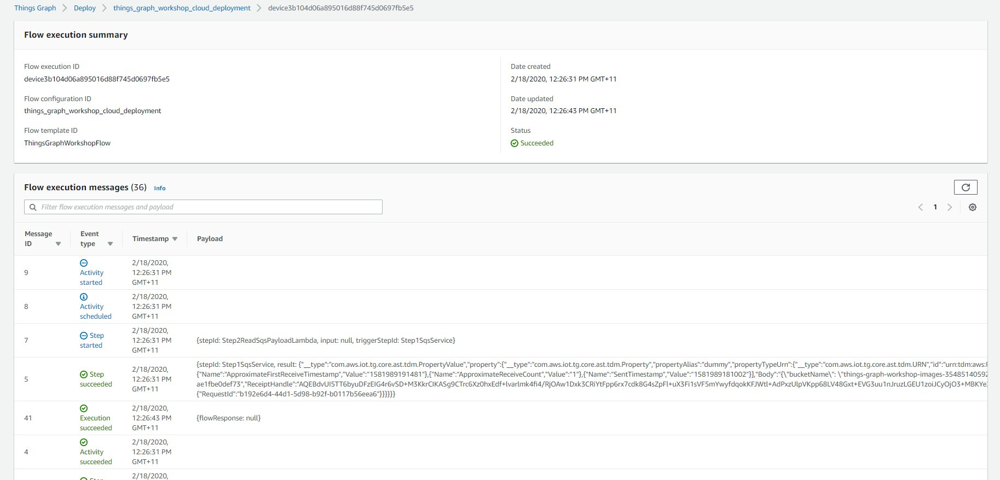


### **To change your flow**

So far we have created a workflow which processes an image of a gauge that has been uploaded to Amazon S3, which triggers a message to be published to a MQTT topic. Now we will modify the flow to send alarms to an Amazon SNS topic based on a reading exceeding a sensor threshold.

1. Open the AWS IoT Things Graph console, and in the navigation pane select **Flows**.
2. Select the flow **ThingsGraphWorkshopFlow** and choose **Edit**.

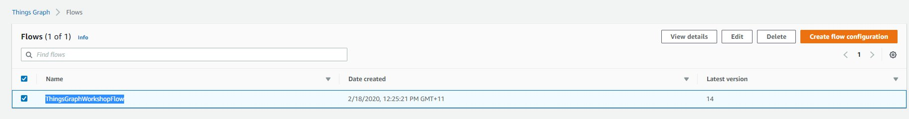

3. From the **Library** pane on the right, select the **Logic** tab.

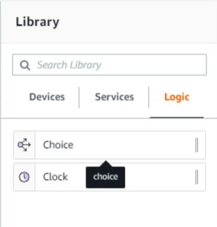


4. Drag and drop a **Choice** node onto the flow designer.
5. Select the **Choice** node and edit its details in the right hand pane, as follows:
   1. **Choice title** : Check Threshold
   1. **Rule A** 
      1. **Title**: Above Threshold
      1. **Condition**: ${readGaugeResult.gaugeReading >= gaugeType.threshold }
      1. **Events**
         1. click on **Add event**
         1. **Name**: AboveThreshold
6. Choose **Add rule** at the bottom of the pane , and enter the details of **Rule B** as follows
   1. **Rule B**
      1. **Title**: Bellow Threshold
      1. **Condition**: ${readGaugeResult.gaugeReading < gaugeType.threshold }
      1. **Events**
         1. click on **Add event**
         1. **Name**: BellowThreshold
7. Connect the last step of the flow to the new **Choice** node

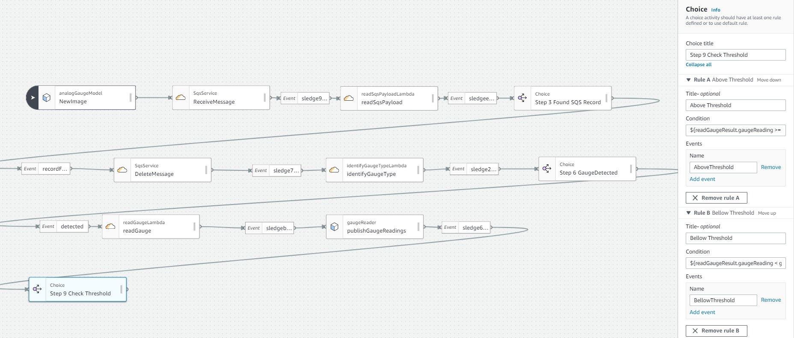

8. To connect the **Choice** node to Amazon SNS. Open the **Library** pane on the right, and select the **Services** tab.
9. Drag and drop two **TGWorkshopSnsService** nodes next to the newly created Choice node.

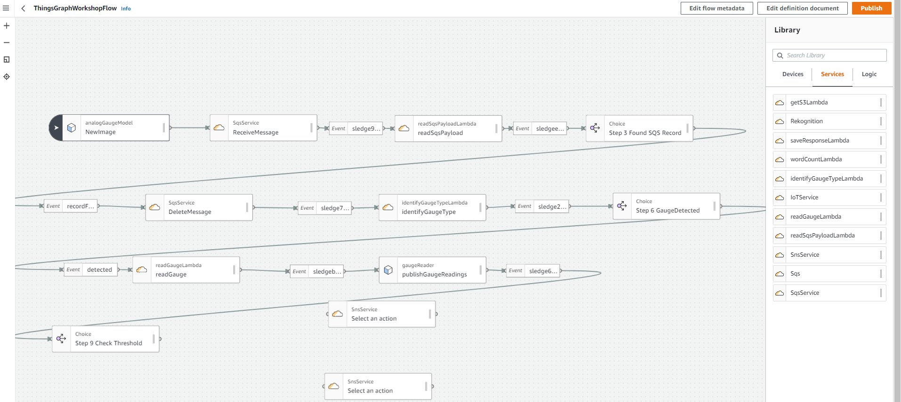

10. Select one of the **TGWorkshopSnsService** nodes and update its details in the pane on the right.
11. Add a new action to the service by selecting **No action configured**.
12. From the **Action** drop down menu select **PublishMessage** and enter the following information:
   - **topicArn**: ${sqsResult.snsTopicArn}
   - **subject**: workshop
   - **message**: AboveThreshold

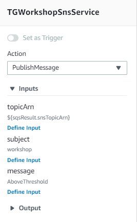


13. Connect the **Choice** node **Check Threshold** to the newly updated **TGWorkshopSnsService** node and name the event **AboveThreshold.**

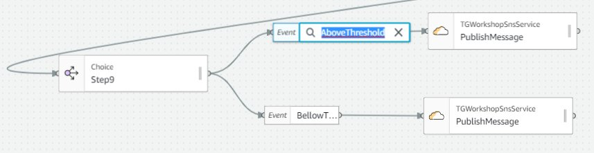

14. Select the other **TGWorkshopSnsService** and update its details on the pane on the right.
15. Add a new action to the service by selecting **No action configured**. From the **Action** drop down menu select **PublishMessage** and enter the following information:
   - **topicArn**: ${sqsResult.snsTopicArn}
   - **subject**: workshop
   - **message**: BellowThreshold

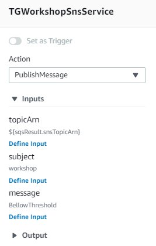


16. Connect the **Choice** node **Check Threshold** to the newly updated second **TGWorkshopSnsService** node and name the event **BellowThreshold**. Your final flow should like the following diagram.

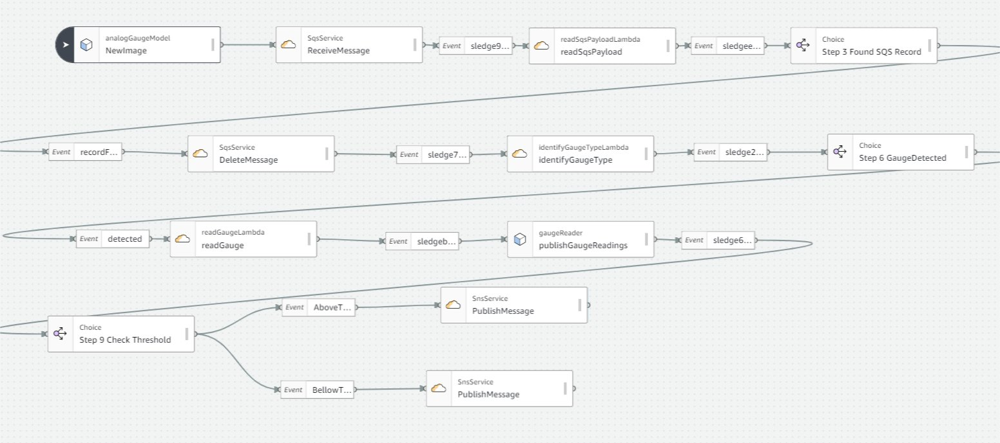

17. Choose **Publish** to publish your flow. At the top of the screen you should see a green notification on successful modification of the flow.

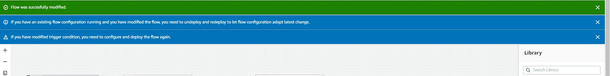

Pay attention to the notifications displayed at the top of the page to check if you have any errors, which you will need to correct your flow before you can successfully publish it.
### **To test recent changes to the flow** 

You will need to redeploy the existing **flow configuration** for the changes to take effect. To do this, take the following steps:

1. Open the AWS IoT Things Graph console, and in the navigation pane, select **Deploy**.
1. Then select your flow, choose **Undeploy,** confirm the un-deployment and choose **Submit**. Refresh the page and deploy the flow again.
1. Before we can send Amazon SNS notifications with our flow we need to subscribe to an Amazon SNS topic. Open the Amazon SNS console, and in the navigation pane select **Subscriptions**.
1. Then choose **Create subscription.** In the **Create subscription** page enter the following details:
   - **Topic Arn**: choose the correct topic from the list, the format will be **arn:aws:sns:RegionName:AccountNumber:things-graph-workshop-topic**
   - **Protocol**: SMS
   - **Endpoint**: your mobile number including country prefix
1. Choose **Create subscription.**

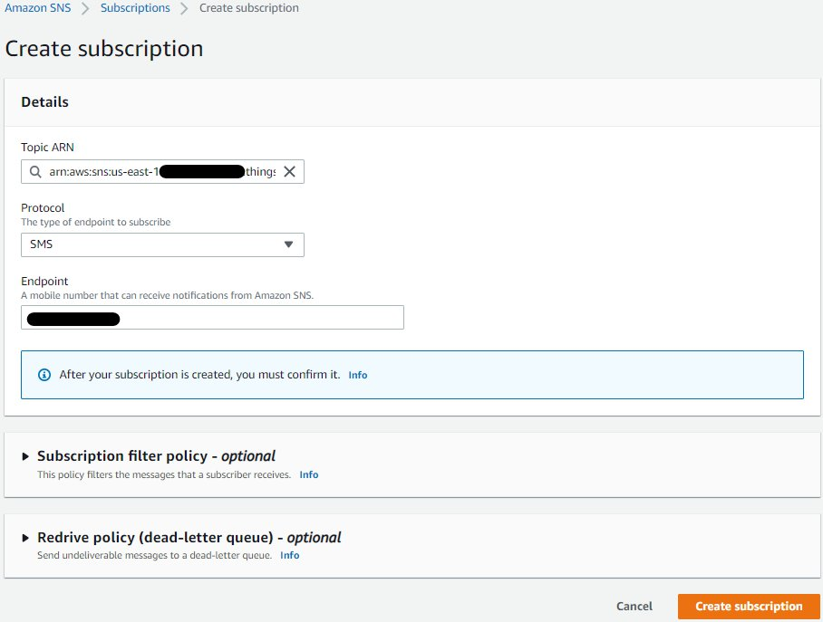


# **To deploy a flow on AWS IoT Greengrass**

In this section we will deploy an AWS IoT Things Graph** flow to the edge on AWS IoT Greengrass that is being hosted on an Amazon EC2 instance.
## **Architecture**

The following diagram depicts the architecture of the solution for the second part of this workshop that describes deploying a flow to the edge.

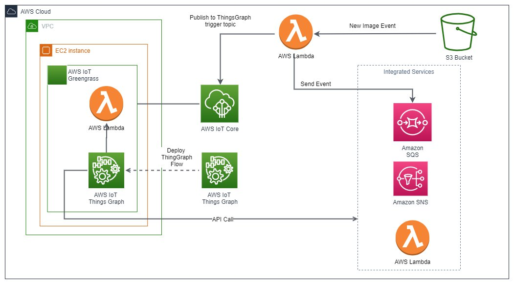

## **Getting Started**

In the first part of this workshop, you created all the resources required for this section. We will first review some of these resources.

1. Open the AWS IoT Greengrass console, and in the navigation pane, select Classic(V1) and then Groups.
2. You should see two new Greengrass groups created as part of this workshop. Select the one that ends with **ec2-gg**.

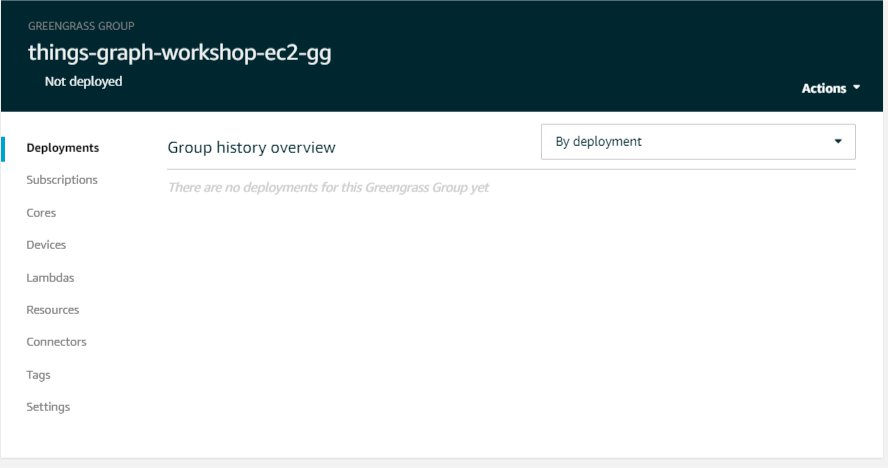

3. You will see that the history for deployments is empty for this AWS IoT Greengrass group and that it has not been deployed to a device before.

4. From the left hand menu select **Subscriptions.** Notice that there are no subscriptions created by default for this AWS IoT Greengrass group. AWS IoT Things Graph will create all the subscriptions necessary for this workshop.

5. From the same left hand menu you can also see Lambda functions and devices that are associated with this AWS IoT Greengrass group. 

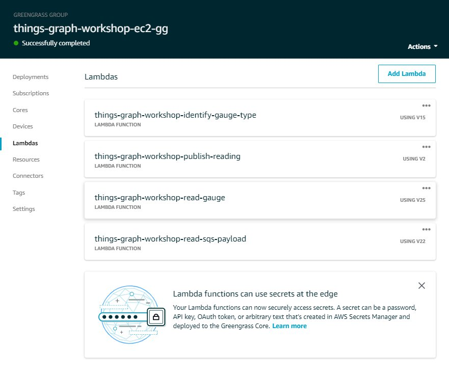


## **Creating the Flow**
1. Open the AWS IoT Things Graph console, and in the navigation pane, select **Flows**. Then choose **Create flow**.
2. Create the flow by navigating to Things Graph > Flows, then select **Create flow**.


3. Set the **Title of flow** to **ThingsGraphWorkshopEC2Flow** and choose **Create Flow**.
4. In the AWS console, choose **Edit definition document**. 


5. Copy and paste the contents of the modified **models-tmp/flows/ec2-flow.graphql** file from your Cloud9 editor and paste it into the editor and choose **Update**.

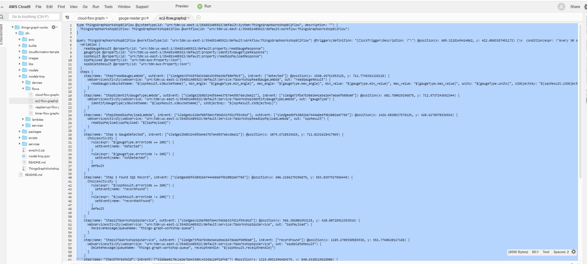

6. You can now see the graphical diagram of the flow.

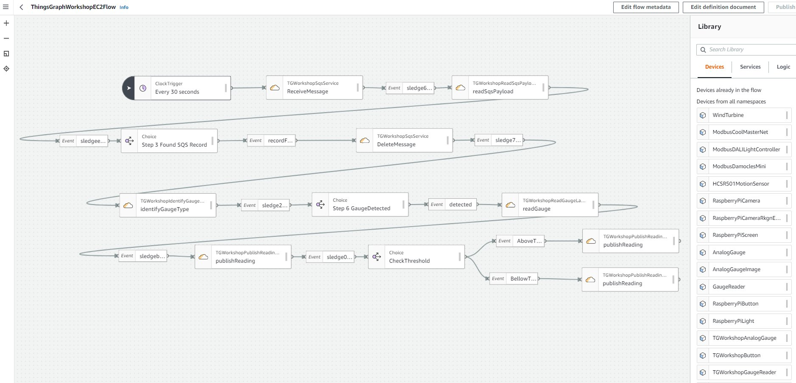

7. Choose **Publish**.


Review the published AWS IoT Things Graph flow. The flow is triggered every 30 seconds and checks if there are any messages recently published to Amazon SQS. The flow then processes that image and reads the gauge.
### **To Deploy the flow on AWS IoT Greengrass**

Once you have published your flow you can choose to deploy it to either the cloud or your AWS IoT Greengrass device at the edge. In this section we will deploy the flow to AWS IoT Greengrass hosted on an Amazon EC2 instance.

1. Open the AWS IoT Things Graph console, and in the navigation pane select **Deploy**. 
2. First we need to un-deploy any existing flow configurations that we created in this workshop. Select any flow that has a status of **Deployed in target** and choose **Undeploy**. This is to make sure our deployed flows do not affect each other during our tests.
3. Then create a new deployment by selecting **Create flow configuration**. 


4. In the **Flow configurations** page:
   - Set the **Flow** to **ThingsGraphWorkshopEC2Flow** from the drop down.
   - Set the **Name** to **things\_graph\_workshop\_ec2\_deployment**.
   - Set the flow to run in **Greengrass** and choose **Next**.

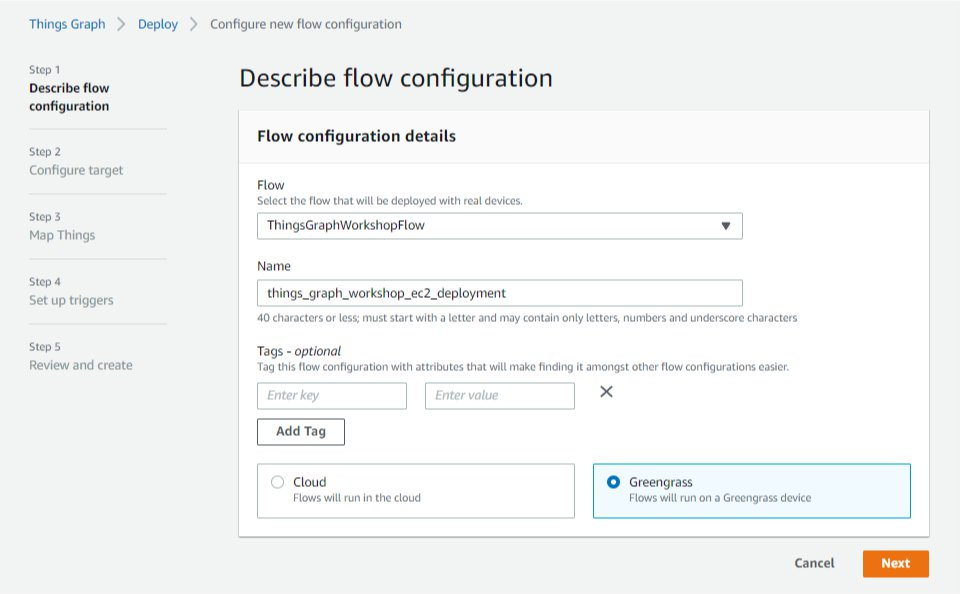


Next, you are asked for an Amazon S3 bucket that will be used to store your AWS IoT Things Graph artifacts, and the name of the AWS IoT Greengrass group that this flow will be deployed on.

Find the Amazon S3 bucket name in the output of your AWS CloudFormation stack or by finding the role in IAM.

1. Open the AWS CloudFormation console. In the navigation pane, select **Stacks.**
2. Select **things-graph-workshop-stack-1,** select the **Outputs** tab, and copy the **Value** column for the key **ArtifactBucketName.** Use the name of the AWS IoT Greengrass group ending with “ec2-gg” that you noted earlier from the AWS IoT Greengrass console, and then choose **Next**.

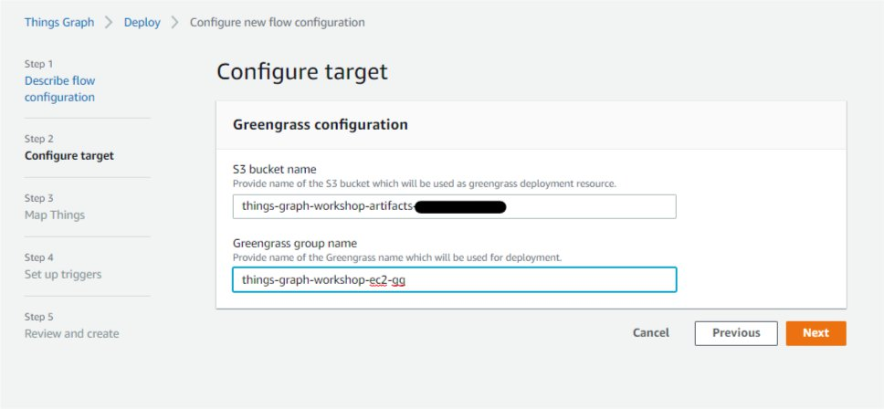

3. Leave the **Set up triggers** page as default and choose **Review**.


4. Scroll down to the bottom of the page and choose **Create**. You have now created an AWS IoT Greengrass** flow configuration in AWS IoT Things Graph.
5. Before deploying the flow to AWS IoT Greengrass, make sure you un-deploy any existing flows that have a status of **Deployed in target**. 
6. Then select your newly created flow from the **Flow configurations** page and choose **Deploy**. You should see a notification at the top of the page for a successful deployment.

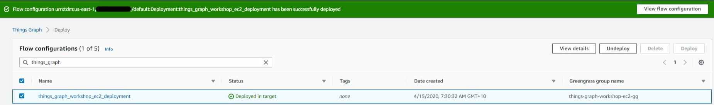

### **To deploy the flow to an Amazon EC2 instance**
1. Open the AWS IoT Greengrass console, and in the navigation pane, select Groups. Select the group that ends with **ec2-gg**. Deploy your Greengrass group to your instance by choosing **Deploy** from the **Action** menu at the top right corner of the page.

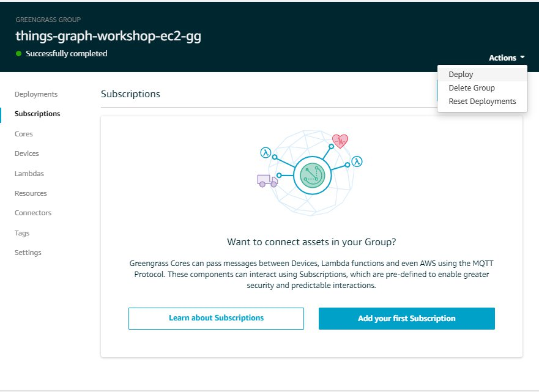

2. Before proceeding, check that your deployment status is **Successfully completed.** If the deployment has a **Failed** status you will need to resolve the underlying issue before proceeding.

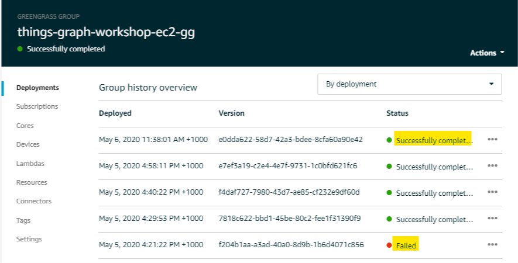


Your AWS IoT Things Graph flow is now running on your Amazon EC2 Instance and you can now start testing the flow.
### **To test your flow**

You can test the new flow by uploading some images to the Amazon S3 bucket.

1. Open the AWS IoT Core console. In the navigation pane, select **Test.**
2. In the **Subscription topic** field enter **things-graph-workshop/gauge/reading** and choose **Subscribe to topic**.


3. Open a new browser tab and open the Amazon S3 console.
4. Select the bucket, **things-graph-workshop-images-${accountNumber}-${region}** and upload your images. You can find images of different gauges inside of your project repository in the **images/gauge/temperature** folder.


5. After you have uploaded the images to the Amazon S3 bucket, return to your browser tab showing AWS IoT Core listening to the MQTT topic. You should see a message appear in about 60 seconds after uploading the image.

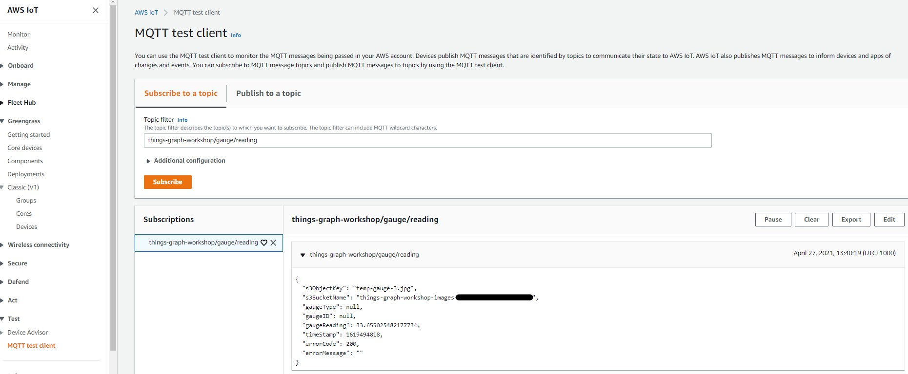


### **To debug the Amazon EC2 instance (optional)**

To further understand how your AWS IoT Things Graph flow is working on the Amazon EC2 instance hosting AWS IoT Greengrass, you will need to ssh to the Amazon EC2 instance running your AWS IoT Things Graph flow and have a deeper look at the log files related to AWS IoT Things Graph execution

```ssh -i {PrivateKeyFile} ubuntu@{EC2PublicIP}```


1. Replace {PrivateKeyFile} with the path to the private key file created as one of the prerequisites steps.
1. Replace {EC2PublicIP} with the public IP of the Amazon EC2 instance, which can be found in the AWS CloudFormation console in the **Outputs** tab of the **things-graph-workshop-stack-2** as the value of **EC2PublicIP**. 

The **ThingsGraph.log** file contains a summary of the steps performed by flow. 

```tail -f /Greengrass/ggc/var/log/user/{Region}/ThingsGraph/ThingsGraph.log```

The **redo.log** file contains a detailed step by step log of the execution of the flow. 

```tail -f /thingsgraph/engine/recovery/redo.log_{Date}```

# **Cleaning Up**

Once you have completed the workshop and experimenting, you should clean up your environment so you do not incur future costs. 

1. Empty all Amason S3 buckets with a prefix of **things-graph-workshop,** this will allow the cloudformation templates to delete them.
2. Open the AWS IoT Greengrass console, and in the navigation pane, select **Groups**.
3. Then for each Greengrass group which you have previously deployed, select it and then choose **Reset Deployment** from the **Action** dropdown menu. This will allow AWS CloudFormation to delete you Greengrass groups.


4. Open the AWS CloudFormation console, and in the navigation page, select **Stacks**. Then delete the AWS CloudFormation stacks you created in previous steps in the reverse order you created them:
   - Delete **things-graph-workshop-stack-3**
   - Delete **things-graph-workshop-stack-2**
   - Delete **things-graph-workshop-stack-1**
   - These stacks are dependent on one another so it’s important for you to follow the above order of deletion.

5. Delete the AWS IoT Things created for the purpose of this workshop.
6. Open the AWS IoT Console and navigate to the Things page from the Manage menu, and then search and select all IoT Things with a name that begins with **things-graph-workshop.** 
7. From the **Actions** dropdown menu choose **Delete** to clean up all the IoT Things.

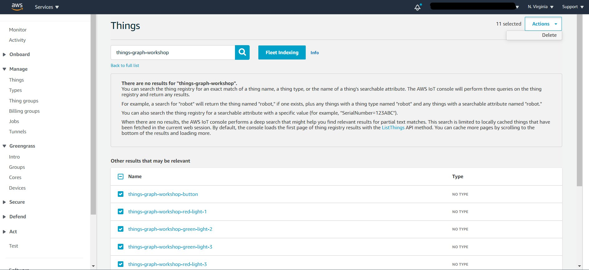

# **Conclusion**

In this post, we described how AWS IoT Thing Graph can be used to monitor analog gauges in an industrial environment. We reviewed how AWS IoT Things Graph can be used to orchestrate complex IoT flows both in the cloud and at the edge, and how it can orchestrate various different sensors, services and functions as part of that flow. We provided step-by-step instructions to create the various different components needed for this solution and the different services involved. We hope this post helps you get started with AWS IoT Things Graph. If you would like to get more familiar with AWS IoT Things Garph refere to [Getting started - AWS IoT Things Graph](https://docs.aws.amazon.com/thingsgraph/latest/ug/iot-tg-gs.html) for further details.
